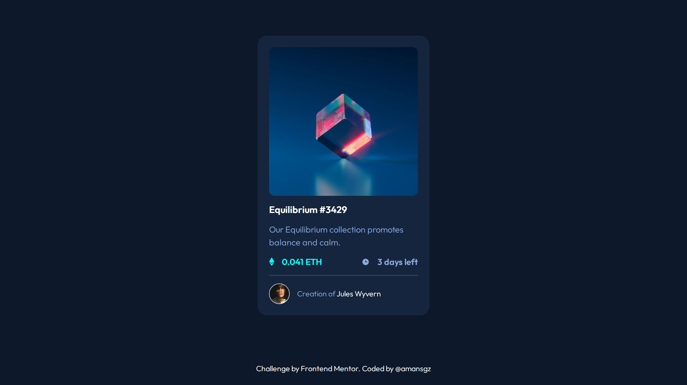

# Frontend Mentor - NFT preview card component

A Frontend Mentor challenge solution implementing BEM methodology with custom prefixes for scalable CSS architecture.

This is a solution to the [NFT preview card component](https://www.frontendmentor.io/challenges/nft-preview-card-component-SbdUL_w0U).

## Table of contents

- [Overview](#overview)
  - [The challenge](#the-challenge)
  - [Screenshot](#screenshot)
  - [Links](#links)
- [My process](#my-process)
  - [Built with](#built-with)
  - [What I learned](#what-i-learned)
  - [Continued development](#continued-development)
  - [Useful resources](#useful-resources)
- [Author](#author)
- [Acknowledgments](#acknowledgments)

## Overview

### The challenge

Users should be able to:

- View the optimal layout depending on their device's screen size
- See hover states for interactive elements

### Screenshot

### Links

- Live Site URL: [https://fem-solutions.github.io/nft-preview-card-component/index.html](https://fem-solutions.github.io/nft-preview-card-component/index.html)

## My process

### Built with

- Semantic HTML5 markup
- BEM Methodology with c-/l- Prefixes
- CSS custom properties
- Flexbox
- Mobile-first workflow

### What I learned

#### BEM Methodology with Custom Prefixes

Refactored the CSS architecture using BEM (Block Element Modifier) with a clear prefix system:

- **`c-` for Components**: Reusable UI elements with semantic purpose (cards, buttons, forms)
- **`l-` for Layout**: Structural containers that organize components on the page

#### Key Implementation:

- Transformed generic class names to semantic BEM structure
- Applied `c-card` as the main component block with nested elements (`c-card__title`, `c-card__image`)
- Used modifiers for variations (`c-card__stat-value--time`)
- Maintained proper separation between layout (`l-container`) and components (`c-card`)

#### Benefits Achieved:

- **Clear component hierarchy** - Immediate understanding of element relationships
- **Improved maintainability** - Easy to update styles without side effects
- **Better scalability** - Consistent pattern for adding new features
- **Team-friendly code** - Standardized naming convention for collaboration

### Continued development

This project solidified my understanding of BEM methodology with custom prefixes. For future growth: test other prefix systems and scale these patterns to larger projects.

### Useful resources

- [Advanced CSS Techniques](https://www.frontendmentor.io/learning-paths/advanced-css-techniques-vdOtKjIC4V) - This challenge is part of Frontend Mentor's learning path, which offers defined strategies to keep your code organized as you progress to more complex web development projects.

## Author

- Frontend Mentor - [@amansgz](https://www.frontendmentor.io/profile/amansgz)
- Github - [@amansgz](https://github.com/amansgz)

## Acknowledgments

- [Frontend Mentor](https://www.frontendmentor.io/) challenges help you improve your coding skills by building realistic projects.
- [DeepSeek AI](https://www.deepseek.com/) assistance with English writing and guidance with BEM methodology implementation.
